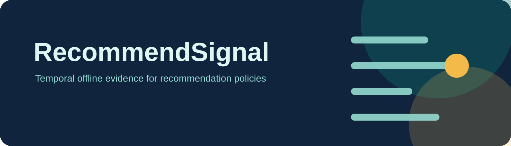

<p align="center">
  
</p>

<p align="center">
  <a href="https://github.com/UlrikErlingsen/recommender-evaluation/actions/workflows/tests.yml"></a>
  
  
  <a href="LICENSE"></a>
</p>

<p align="center"><strong>Open recommendation-policy evidence—replay the past honestly, compare trade-offs, then test the finalist live.</strong></p>

> **Working-name status:** a basic screen on 16 July 2026 found no obvious exact active software product called “RecommendSignal.” That is encouraging, but it is not trademark clearance. Keep the label provisional until official registers, company names, domains, package registries, app stores, and relevant jurisdictions have been professionally checked. See [the name screen](docs/name-screen.md).

RecommendSignal is an open, local-first workbench for comparing transparent recommendation policies under global-timeline temporal holdouts. It asks:

> Which declared policy retrieves more later interactions, how does it distribute recommendation exposure, and where does performance change across cold-start cases and subgroups?

It compares popularity, content-based, item-item collaborative, and preweighted hybrid policies. It deliberately does **not** turn the results into one magical recommendation score.

## Read this first

> **Offline replay can reject weak policies and expose trade-offs; it cannot demonstrate incremental business lift.** Historical interactions were created under earlier exposure, selection, and availability policies. Preregister the finalist and test it through ExperimentSignal before claiming effects on sales, retention, satisfaction, or welfare.

## Try it in three minutes

1. Start the app; the deterministic fictional interaction log and item catalog load automatically.
2. Open **1 · Data & temporal contract** and inspect the global cutoffs, item availability, user history, and subgroup support.
3. Compare all four policies on **2 · Offline leaderboard**.
4. Use **3 · Trade-offs & stability** to inspect discovery, concentration, uncertainty, and fold variation.
5. Check cold-user, cold-item, and subgroup evidence on page 4, then download the auditable workbook on page 5.

The demonstration contains no real customers, items, preferences, or commercial outcomes.

## What it evaluates

- Recall@K and binary-relevance NDCG@K;
- catalog coverage and smoothed self-information novelty;
- recommendation-exposure HHI and top-10-item share;
- cold-user and cold-item recall;
- subgroup performance and max-minus-min gaps;
- fold-to-fold stability;
- paired policy differences with user-level uncertainty and Benjamini–Hochberg adjustment.

## Evaluation contract

RecommendSignal creates expanding training windows along one global timeline. Each model sees only events before a fold cutoff. Its test window follows the cutoff without overlap, and only items declared available at prediction time enter the candidate catalog.

The app evaluates the complete eligible catalog. It does not manufacture sampled negatives. Previously interacted items are excluded from each user’s candidate set. Logged interactions are treated as observed positive behavior—not as complete relevance judgments and not as proof that unobserved items were disliked.

## Four transparent baselines

- **Popularity:** weighted pre-cutoff interaction frequency.
- **Content-based:** cosine similarity between item features and a weighted user profile.
- **Collaborative:** item-item cosine similarity from the implicit user-item matrix.
- **Hybrid:** a declared weighted combination of within-user score ranks. Record the mix before inspecting holdout results; repeatedly changing it turns the holdout into tuning data.

These are legible baselines for policy screening, not production serving systems. The collaborative implementation intentionally caps catalogs at 2,500 items because it materializes an item-similarity matrix for transparency.

## Methods & boundaries

Offline ranking accuracy does not demonstrate incremental sales, margin, retention, satisfaction, long-term welfare, or causal lift. Historical logs were created under earlier exposure and selection policies. A final policy should be preregistered and randomized through **ExperimentSignal** before a business-impact claim is made.

## Input data

Interactions require:

- `user_id`
- `item_id`
- `timestamp`

Optional interaction fields are positive `event_weight`, stable `subgroup`, and any descriptive columns such as `event_type`.

The item catalog requires unique `item_id`, `item_name`, at least one finite numeric column beginning `feature_`, and preferably `available_at`. If availability is absent, the app explicitly warns that the full catalog is assumed to predate the event log.

See the complete [data guide](docs/data-guide.md) and [methods](docs/methods.md) for validation rules, formulas, bootstrap details, and limitations.

## Evidence pack

The XLSX export records the source and temporal contract, fold boundaries, declared configuration, policy summaries, paired user-level contrasts, subgroup and cold-start tables, fold stability, recommendation slates, diagnostics, and limitations. CSV downloads provide the primary policy summary and paired contrasts. The pack deliberately contains no universal score or declaration of commercial lift.

## Run locally

On macOS:

```bash
./run_app.command
```

Or manually:

```bash
python3 -m venv .venv
.venv/bin/python -m pip install -e .
.venv/bin/python -m streamlit run app.py
```

Windows users can double-click `run_app.bat`.

Docker is also supported:

```bash
docker build -t recommendsignal .
docker run --rm -p 8587:8587 recommendsignal
```

## No install? Give this folder to an AI

Ask a coding assistant to read [AI_ANALYST.md](AI_ANALYST.md), install the project locally, run the fictional demonstration, and explain the evidence pack. That protocol requires support, uncertainty, policy trade-offs, and the offline-versus-causal boundary to remain visible.

## Privacy

RecommendSignal has no accounts, telemetry, advertising, or built-in cloud upload. Files are processed in the running Streamlit session. Recommendation logs can reveal sensitive preferences, so deployment operators remain responsible for access controls, minimization, retention, lawful basis, and disclosure risk.

## Development checks

```bash
python -m pip install -e ".[test]"
python -m pytest
python -m ruff check .
python -m build
```

The test suite covers temporal leakage, item availability, candidate construction, every metric and baseline, cold-start and subgroup logic, workbook exports, product boundaries, and every Streamlit page.

## Relationship to the Signal suite

- **[ExperimentSignal](https://github.com/UlrikErlingsen/experiment-analysis)** tests the finalist’s incremental effect with randomized assignment.
- **[TextSignal](https://github.com/UlrikErlingsen/open-text-analysis)** audits open-text evidence that may inform item or content features.
- **[SegmentSignal](https://github.com/UlrikErlingsen/customer-segmentation)** explores customer structure; subgroup results here remain diagnostic rather than a fairness verdict.
- **[AllocSignal](https://github.com/UlrikErlingsen/marketing-mix-allocation)** plans media economics and must not treat offline recommendation accuracy as causal return.
- **[WorthSignal](https://github.com/UlrikErlingsen/customer-value-analytics)** values the customers a recommender serves; **[PriceSignal](https://github.com/UlrikErlingsen/pricing-analysis)** prices what it recommends; **[GateSignal](https://github.com/UlrikErlingsen/launch-decision-gate)** decides whether the recommender project itself deserves the next investment.

RecommendSignal shares the suite’s local-first, named-method, fictional-demo, portable-evidence, and explicit-boundary standard. The portfolio overview is at [ulrikerlingsen.com](https://ulrikerlingsen.com).

## Academic independence and originality

The application is independently designed and written from general public recommender-systems and information-retrieval literature. Its interface, evaluation contract, algorithms, examples, wording, decision rules, and code are original to this project. It does not reproduce lecture slides, notes, cases, exercises, diagrams, assessment material, datasets, questionnaire wording, or institution-specific frameworks; general topics encountered in education only define the problem domain. All bundled examples are fictional and generated by code.

See the [decision guide](docs/decision-guide.md) and [sources and originality](docs/sources-and-originality.md). Contributions must not include lecture material, private recommendation logs, or proprietary datasets; see [CONTRIBUTING.md](CONTRIBUTING.md), [PRIVACY.md](PRIVACY.md), and [SECURITY.md](SECURITY.md).

## License

AGPL-3.0-or-later. See [LICENSE](LICENSE).
