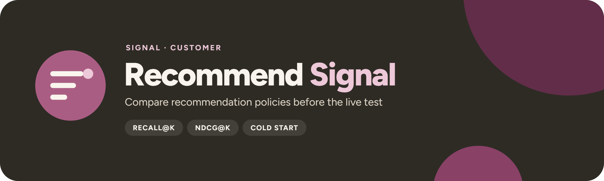

<p align="center">
  
</p>

<p align="center">
  <a href="https://github.com/UlrikErlingsen/recommender-evaluation/actions"></a>
  <a href="https://github.com/UlrikErlingsen/signal-hub"></a>
  
  
  <a href="LICENSE"></a>
</p>

<p align="center"><strong>Open recommendation-policy evidence—replay the past honestly, compare trade-offs, then test the finalist live.</strong></p>

**Recommend Signal** is an open, local-first workbench for comparing transparent recommendation policies under global-timeline temporal holdouts. It compares popularity, content-based, item-item collaborative, and preweighted hybrid policies on the same eligible users and catalog. It asks:

> Which declared policy retrieves more later interactions, how does it distribute recommendation exposure, and where does performance change across cold-start cases and subgroups?

Everything runs locally with open-source Python packages. There is no account, telemetry, advertising, external AI call, remote database, cloud upload, or built-in persistence.

## Read this first

> **Offline replay can reject weak policies and expose trade-offs; it cannot demonstrate incremental business lift.** Historical interactions were created under earlier exposure, selection, and availability policies. Preregister the finalist and test it through Experiment Signal before claiming effects on sales, retention, satisfaction, or welfare.

- Recommend Signal deliberately does **not** turn the results into one magical recommendation score. Ranking accuracy sits beside coverage, novelty, concentration, cold-start, and subgroup diagnostics.
- Logged interactions are observed positive behavior—not complete relevance judgments and not proof that unobserved items were disliked.
- Subgroup gaps are descriptive diagnostics, not a fairness verdict.

**Working-name status:** a basic screen on 16 July 2026 found no obvious exact active software product called “RecommendSignal” (written “Recommend Signal” since 1.1.0; the spelling change claims no new clearance). That is encouraging, but it is not trademark clearance. Keep the label provisional until official registers, company names, domains, package registries, app stores, and relevant jurisdictions have been professionally checked. See [the name screen](docs/name-screen.md).

## Scope

**Version 1.1 supports:**

- an interaction log (one row per observed positive event) and an item catalog with numeric `feature_` columns, as CSV or XLSX;
- four transparent baselines: popularity, content-based, item-item collaborative, and a preweighted hybrid;
- global-timeline expanding-window folds with item availability at each cutoff;
- Recall@K and binary-relevance NDCG@K;
- catalog coverage and smoothed self-information novelty;
- recommendation-exposure HHI and top-10-item share;
- cold-user and cold-item recall;
- subgroup performance and max-minus-min gaps;
- fold-to-fold stability;
- paired policy differences with user-level uncertainty and Benjamini–Hochberg adjustment;
- an auditable XLSX evidence pack.

**It does not:** estimate incremental sales, margin, retention, satisfaction, long-term welfare, or causal lift, produce a universal recommendation score, use sampled negatives, treat logged noninteraction as a known dislike, deliver a fairness or discrimination verdict, or serve production recommendations (context, sequence, diversity reranking, constraints, inventory, and latency are out of scope). Where a sibling app covers it, use **[Experiment Signal](https://github.com/UlrikErlingsen/experiment-analysis)** for a randomized test of the finalist, **[Segment Signal](https://github.com/UlrikErlingsen/customer-segmentation)** for customer structure, and **[Text Signal](https://github.com/UlrikErlingsen/open-text-analysis)** for open-text evidence behind item features.

## Try the demo in three minutes

1. Start the app; the deterministic fictional interaction log and item catalog load automatically.
2. Open **1 · Data & temporal contract** and inspect the global cutoffs, item availability, user history, and subgroup support.
3. Compare all four policies on **2 · Offline leaderboard**.
4. Use **3 · Trade-offs & stability** to inspect discovery, concentration, uncertainty, and fold variation.
5. Check cold-user, cold-item, and subgroup evidence on page 4, then download the auditable workbook on page 5.

The demonstration contains no real customers, items, preferences, or commercial outcomes.

## Data contract

Upload two tables, as CSV or XLSX: an interaction log and an item catalog. Workbooks may use `interactions` and `items` sheet names; when absent, the first sheet is read. Uploads are capped at 50 MB (workbooks additionally at 200 MB expanded, 500,000 rows, and 200 columns).

Interactions require:

- `user_id`
- `item_id`
- `timestamp`

Optional interaction fields are positive `event_weight`, stable `subgroup`, and any descriptive columns such as `event_type`.

| user_id | item_id | timestamp | event_weight | event_type | subgroup |
|---|---|---|---|---|---|
| USER-0005 | ITEM-013 | 2025-01-01T12:00:00+00:00 | 2.0 | save | Focused regulars |

The item catalog requires unique `item_id`, `item_name`, at least one finite numeric column beginning `feature_`, and preferably `available_at`. If availability is absent, the app explicitly warns that the full catalog is assumed to predate the event log.

| item_id | item_name | available_at | feature_practical | feature_creative | … |
|---|---|---|---|---|---|
| ITEM-001 | Fictional selection 001 | 2025-01-01T00:00:00+00:00 | 1.0 | 0.0 | … |

The contract rejects exact user-item-timestamp duplicates, nonpositive event weights, users whose subgroup label changes, interactions before an item’s declared availability, and catalogs without numeric content features. The fictional data and starter templates are in [`examples/`](examples/). See the complete [data guide](docs/data-guide.md) for validation rules.

## Analysis contract

Declare the evaluation contract in the sidebar before reading the results. The settings are recorded in the evidence pack:

- **Recommendation depth K**, **temporal folds**, and the **initial training share** of the global timeline.
- **Minimum pre-cutoff items** a user needs to be evaluated, plus the **cold-user** and **cold-item** ceilings.
- **Declared hybrid mix** (Balanced, Collaborative-led, or Content-led). Record the mix before inspecting holdout results; repeatedly changing it turns the holdout into tuning data.
- **Contrast reference**: the policy every other policy is compared with.

Event weights affect model fitting, not the binary test relevance definition; document the weighting rule before evaluation. The [starter templates](examples/recommendsignal-starter-templates.xlsx) show the expected columns.

## Methods

Recommend Signal creates expanding training windows along one global timeline. Each model sees only events before a fold cutoff. Its test window follows the cutoff without overlap, and only items declared available at prediction time enter the candidate catalog.

The app evaluates the complete eligible catalog. It does not manufacture sampled negatives. Previously interacted items are excluded from each user’s candidate set. Logged interactions are treated as observed positive behavior—not as complete relevance judgments and not as proof that unobserved items were disliked.

Four transparent baselines:

- **Popularity:** weighted pre-cutoff interaction frequency.
- **Content-based:** cosine similarity between item features and a weighted user profile.
- **Collaborative:** item-item cosine similarity from the implicit user-item matrix.
- **Hybrid:** a declared weighted combination of within-user score ranks. Record the mix before inspecting holdout results; repeatedly changing it turns the holdout into tuning data.

These are legible baselines for policy screening, not production serving systems. The collaborative implementation intentionally caps catalogs at 2,500 items because it materializes an item-similarity matrix for transparency.

Recall and NDCG are averaged within user across folds, then across users, with percentile-bootstrap intervals over user-level means. Policy contrasts pair candidate and reference metrics on the same users and report a paired user-level t interval with Benjamini–Hochberg q-values.

Offline ranking accuracy does not demonstrate incremental sales, margin, retention, satisfaction, long-term welfare, or causal lift. Historical logs were created under earlier exposure and selection policies. A final policy should be preregistered and randomized through **Experiment Signal** before a business-impact claim is made.

See [methods](docs/methods.md) for formulas, bootstrap details, and limitations.

## Decision statuses

Each paired contrast (candidate minus reference, per metric) receives an offline evidence label. The difference and interval remain primary; the label never becomes a causal or commercial claim.

- **CLEAR OFFLINE INCREASE**: the paired interval lies above zero and the BH q-value is at most .05.
- **CLEAR OFFLINE DECREASE**: the paired interval lies below zero and the BH q-value is at most .05.
- **UNCERTAIN OFFLINE DIFFERENCE**: the interval includes zero, or the q-value exceeds .05.

See the [decision guide](docs/decision-guide.md), including the handoff to Experiment Signal.

## Exports

The XLSX evidence pack records:

- the app, version, name status, data source, evaluation type, candidate protocol, decision boundary, and next step;
- the declared configuration and the data audit;
- fold boundaries and subgroup counts;
- policy summaries, paired user-level contrasts, fold stability, and subgroup and cold-start tables;
- user-level metrics, recommendation slates, fold diagnostics, and limitations.

CSV downloads provide the primary policy summary and paired contrasts. The pack deliberately contains no universal score or declaration of commercial lift. Exported text is neutralised against spreadsheet-formula interpretation.

## Run locally

You need Python 3.10 or newer and a local copy of this folder.

**macOS:** double-click `run_app.command`. **Windows:** double-click `run_app.bat`.

The first launch creates a private `.venv` and downloads open-source dependencies. Later launches reuse it. Or use a terminal:

```bash
python3 -m venv .venv
source .venv/bin/activate  # Windows: .venv\Scripts\activate
python -m pip install -r requirements.txt
python -m streamlit run app.py
```

Recommend Signal prefers local port `8587` and falls back to another free port on macOS. Set `RECOMMENDSIGNAL_PORT` to choose a port, `RECOMMENDSIGNAL_MAX_UPLOAD_MB` to change Streamlit’s upload limit (the reader still caps files at 50 MB), `RECOMMENDSIGNAL_NO_BROWSER=1` to suppress browser opening on macOS, or `RECOMMENDSIGNAL_DEBUG=1` to reveal unexpected technical error details.

### Docker

```bash
docker build -t recommendsignal .
docker run --rm -p 8587:8587 recommendsignal
```

Then open `http://127.0.0.1:8587`. The container runs as a non-root user and includes a health check.

## Privacy

Recommend Signal has no accounts, telemetry, advertising, or built-in cloud upload. Files are processed in the running Streamlit session. Recommendation logs can reveal sensitive preferences, so deployment operators remain responsible for access controls, minimization, retention, lawful basis, and disclosure risk. See [PRIVACY.md](PRIVACY.md).

## No install? Give this file to an AI

[AI_ANALYST.md](AI_ANALYST.md) is a standalone analysis protocol for a capable AI assistant, with the same scope limits, calculations, and honesty rules. It requires support, uncertainty, policy trade-offs, and the offline-versus-causal boundary to remain visible. The local app is the more private option: a cloud AI sees whatever you upload or paste.

## Development

```bash
python -m pip install -e ".[test]"
python -m pytest
python -m ruff check .
python -m build
```

The analysis core (`recommendsignal`) installs without Streamlit or Plotly; the app needs the `ui` extra (`python -m pip install -e ".[ui]"`), and `requirements.txt` installs it for the launchers. [Signal Hub](https://github.com/UlrikErlingsen/signal-hub) embeds the app through `recommendsignal.ui.render()`.

The test suite covers temporal leakage, item availability, candidate construction, every metric and baseline, cold-start and subgroup logic, workbook exports, product boundaries, the shared Signal shell, every Streamlit page, and the Signal Hub contract (no Streamlit import outside `ui/`, `render()` without a page config, namespaced keys).

## Where this fits in Signal

Recommend Signal narrows candidate recommendation policies offline; **Experiment Signal** then tests the finalist with randomized assignment. It shares the suite’s local-first, named-method, fictional-demo, portable-evidence, and explicit-boundary standard.

- **[Experiment Signal](https://github.com/UlrikErlingsen/experiment-analysis)** tests the finalist’s incremental effect with randomized assignment.
- **[Text Signal](https://github.com/UlrikErlingsen/open-text-analysis)** audits open-text evidence that may inform item or content features.
- **[Segment Signal](https://github.com/UlrikErlingsen/customer-segmentation)** explores customer structure; subgroup results here remain diagnostic rather than a fairness verdict.
- **[Alloc Signal](https://github.com/UlrikErlingsen/marketing-mix-allocation)** plans media economics and must not treat offline recommendation accuracy as causal return.
- **[Worth Signal](https://github.com/UlrikErlingsen/customer-value-analytics)** values the customers a recommender serves; **[Tag Signal](https://github.com/UlrikErlingsen/pricing-analysis)** prices what it recommends; **[Gate Signal](https://github.com/UlrikErlingsen/launch-decision-gate)** decides whether the recommender project itself deserves the next investment.
- **[Trace Signal](https://github.com/UlrikErlingsen/journey-path-analysis)** describes how logged customer journeys unfold — transitions, path support, drop-off, and Markov removal sensitivity — with no causal channel credit and no recommendation-policy verdict.
- **[Track Signal](https://github.com/UlrikErlingsen/brand-tracking)** compares brand measures across tracking waves with intervals, multiple-comparison control, and declared practical thresholds.

| App | Asks |
|---|---|
| [Track Signal](https://github.com/UlrikErlingsen/brand-tracking) | Is the brand moving, or is the tracker just noisy? |
| [Position Signal](https://github.com/UlrikErlingsen/brand-positioning) | Where do brands sit relative to competitors? |
| [Prospect Signal](https://github.com/UlrikErlingsen/b2b-prospecting) | Which Norwegian companies fit the ideal customer? |
| [Listen Signal](https://github.com/UlrikErlingsen/media-listening) | What are Norwegian media and social channels saying? |
| [Influence Signal](https://github.com/UlrikErlingsen/influencer-campaigns) | Which creators delivered, and was every post labelled? |
| [Season Signal](https://github.com/UlrikErlingsen/marketing-calendar) | What does the Norwegian marketing year look like, worked backwards? |
| [Adopt Signal](https://github.com/UlrikErlingsen/adoption-forecasting) | When will a new product be adopted? |
| [Worth Signal](https://github.com/UlrikErlingsen/customer-value-analytics) | What are customers and relationships worth? |
| [Segment Signal](https://github.com/UlrikErlingsen/customer-segmentation) | Do customers form stable, useful groups? |
| [Trace Signal](https://github.com/UlrikErlingsen/journey-path-analysis) | How do logged customer journeys actually unfold? |
| [Recommend Signal](https://github.com/UlrikErlingsen/recommender-evaluation) | Which recommendation policy should be tested live? |
| [Choice Signal](https://github.com/UlrikErlingsen/conjoint-analysis) | How do product attributes drive choice? |
| [Driver Signal](https://github.com/UlrikErlingsen/survey-driver-analysis) | Which measured experiences move with satisfaction? |
| [Measure Signal](https://github.com/UlrikErlingsen/measurement-validation) | Does a multi-item score have a defensible structure? |
| [Text Signal](https://github.com/UlrikErlingsen/open-text-analysis) | What recurring patterns appear in open-ended responses? |
| [Tag Signal](https://github.com/UlrikErlingsen/pricing-analysis) | What price range is supported, and how does profit move? |
| [Experiment Signal](https://github.com/UlrikErlingsen/experiment-analysis) | Did the treatment cause a practically meaningful change? |
| [Gate Signal](https://github.com/UlrikErlingsen/launch-decision-gate) | Does a concept deserve the next investment? |
| [Alloc Signal](https://github.com/UlrikErlingsen/marketing-mix-allocation) | Where should the next marketing budget go? |

The maintained public suite is listed at [ulrikerlingsen.com](https://ulrikerlingsen.com) and in [Signal Hub](https://github.com/UlrikErlingsen/signal-hub).

## References

- Herlocker, J. L., Konstan, J. A., Terveen, L. G., & Riedl, J. T. (2004). Evaluating collaborative filtering recommender systems. *ACM Transactions on Information Systems, 22*(1), 5–53. https://doi.org/10.1145/963770.963772
- Järvelin, K., & Kekäläinen, J. (2002). Cumulated gain-based evaluation of IR techniques. *ACM Transactions on Information Systems, 20*(4), 422–446. https://doi.org/10.1145/582415.582418
- Steck, H. (2013). Evaluation of recommendations: Rating-prediction and ranking. *Proceedings of the 7th ACM Conference on Recommender Systems*. https://doi.org/10.1145/2507157.2507160
- Ji, Y., Sun, A., Zhang, J., & Li, C. (2023). A critical study on data leakage in recommender system offline evaluation. *ACM Transactions on Information Systems, 41*(3), 1–27. https://doi.org/10.1145/3569930
- Tian, M., & Ekstrand, M. D. (2020). Estimating error and bias in offline evaluation results. *Proceedings of CHIIR ’20*, 392–396. https://doi.org/10.1145/3343413.3378004
- Beel, J., & Langer, S. (2015). A comparison of offline evaluations, online evaluations, and user studies in the context of research-paper recommender systems. In *Research and Advanced Technology for Digital Libraries (TPDL 2015), Lecture Notes in Computer Science, 9316* (pp. 153–168). Springer. https://doi.org/10.1007/978-3-319-24592-8_12
- Sarwar, B., Karypis, G., Konstan, J., & Riedl, J. (2001). Item-based collaborative filtering recommendation algorithms. *WWW '01*, 285–295. https://doi.org/10.1145/371920.372071
- Cremonesi, P., Koren, Y., & Turrin, R. (2010). Performance of recommender algorithms on top-n recommendation tasks. *RecSys '10*, 39–46. https://doi.org/10.1145/1864708.1864721
- Benjamini, Y., & Hochberg, Y. (1995). Controlling the false discovery rate: A practical and powerful approach to multiple testing. *Journal of the Royal Statistical Society B, 57*(1), 289–300. https://doi.org/10.1111/j.2517-6161.1995.tb02031.x

## Originality and license

Recommend Signal is independently designed and written from general public recommender-systems and information-retrieval literature. Its interface, evaluation contract, algorithms, examples, wording, decision rules, and code are original to this project. It does not reproduce lecture slides, notes, cases, exercises, diagrams, assessment material, datasets, questionnaire wording, or institution-specific frameworks; general topics encountered in education only define the problem domain. All bundled examples are fictional and generated by code.

See the [decision guide](docs/decision-guide.md) and [sources and originality](docs/sources-and-originality.md). Contributions must not include lecture material, private recommendation logs, or proprietary datasets; see [CONTRIBUTING.md](CONTRIBUTING.md), [PRIVACY.md](PRIVACY.md), [SECURITY.md](SECURITY.md), and [CITATION.cff](CITATION.cff).

The software and documentation are free under **AGPL-3.0-or-later**. See [LICENSE](LICENSE). The license covers this project’s expression, not ownership of the published methods it implements.

This application was developed with AI coding assistance and checked through source review, analytical fixtures, deterministic synthetic tests, automated app tests, and visual inspection. Verify material decisions independently; no warranty is provided.

---

<p>
  
  <strong>Recommend Signal</strong> is part of <a href="https://github.com/UlrikErlingsen/signal-hub"><strong>Signal</strong></a>, open marketing-evidence tools by <a href="https://ulrikerlingsen.com">Ulrik Erlingsen</a>.
</p>
